## Como rodar

### Pré-requisitos:
- docker instalado
- vs code instalado
- extensão do Thunder Client instalada no vs code

## 1 - clonar o repositório

```bash
git clone https://github.com/erika-bs/full_stack_p1.git
```

## 2 - Subir os containers

```bash
docker-compose up --build
```
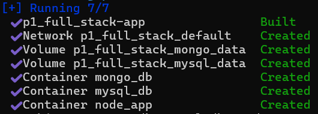

## 3 - Aguardar inicialização

A aplicação irá:

- Conectar ao MySQL
- Criar tabelas automaticamente
- Conectar ao MongoDB

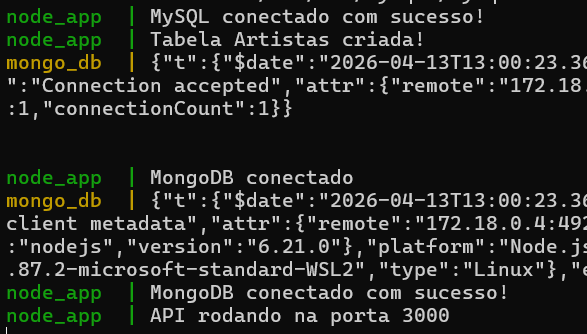

## 4 - Acessar a API 

http://localhost:3000/artistas

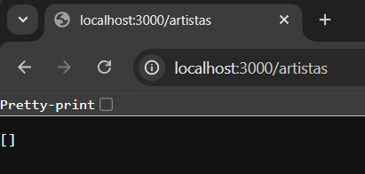

http://localhost:3000/albums

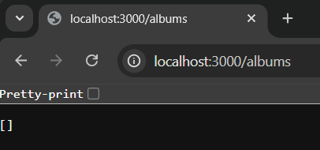

## 5 - Testar endpoints com ThunderClient

## 5.1 - Inserir artistas 

POST http://localhost:3000/artistas 

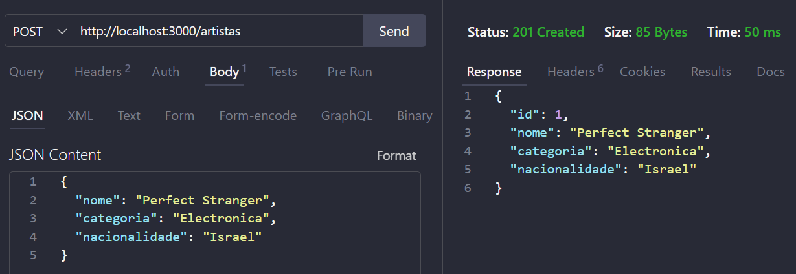

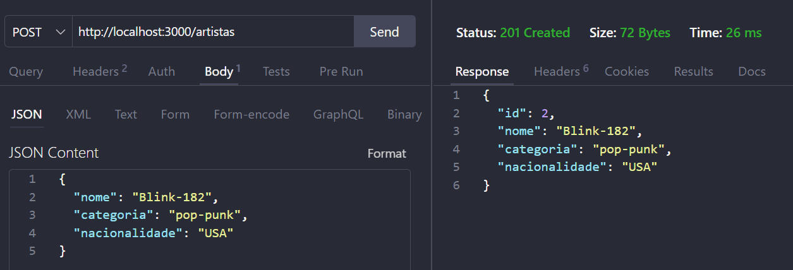

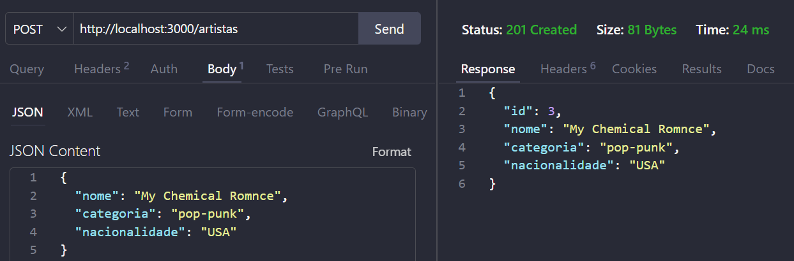

## 5.2 - Atualizar artista

PUT http://localhost:3000/artistas/:id 

Corrigindo erro de digitação no nome:

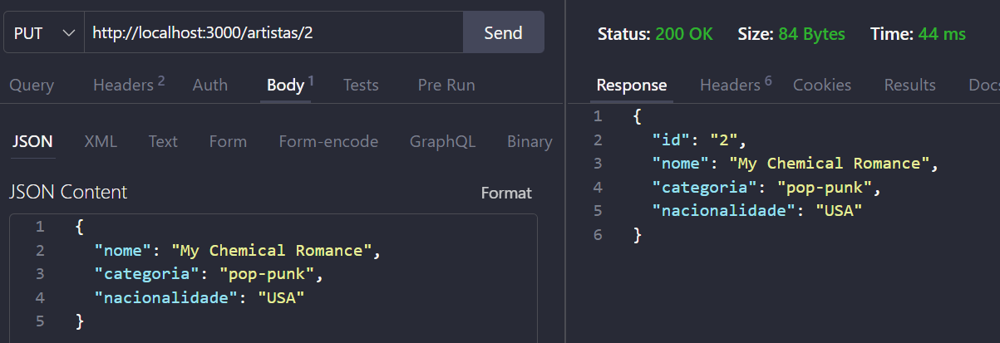

## 5.3 - Listar artistas 

GET http://localhost:3000/artistas 

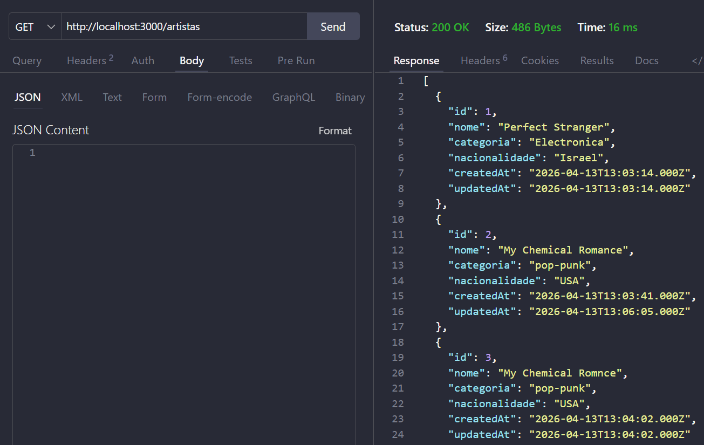

## 5.4 - Deletar artista 

DELETE http://localhost:3000/artistas/:id

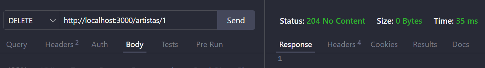

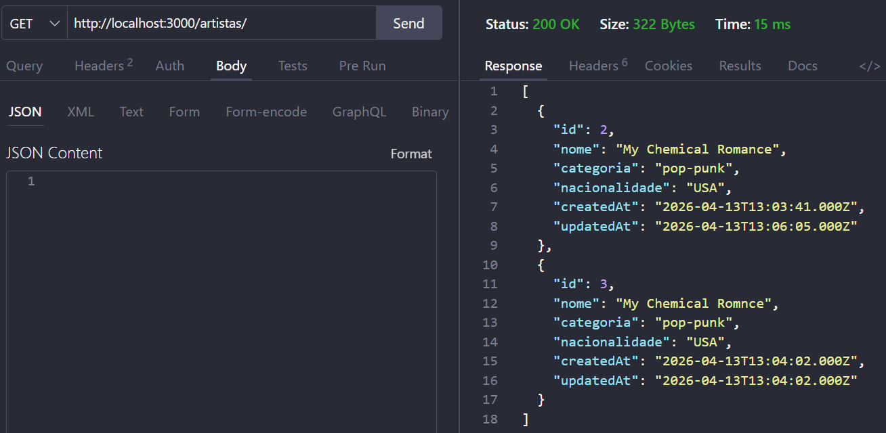

## 5.5 - Inserir albums

POST http://localhost:3000/albums 

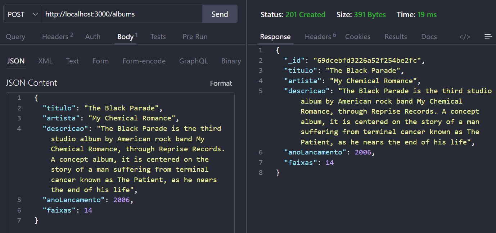

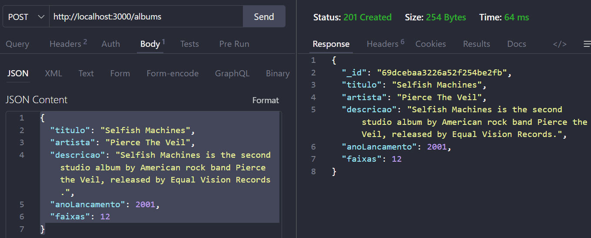

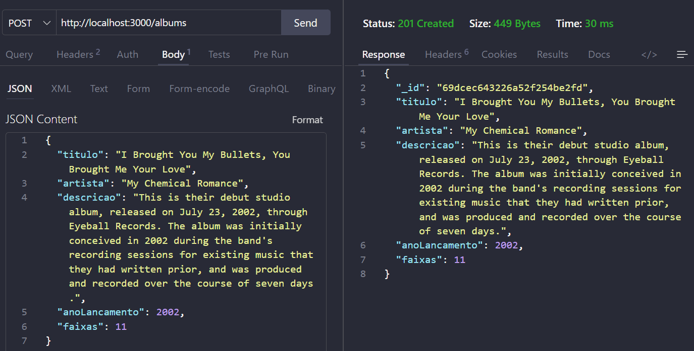

## 5.6 - Atualizar album

PUT http://localhost:3000/albums/:id

Corrigindo data de lançamento

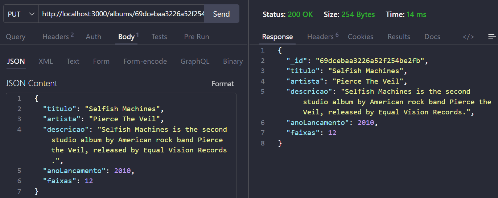

## 5.7 - Listar albums

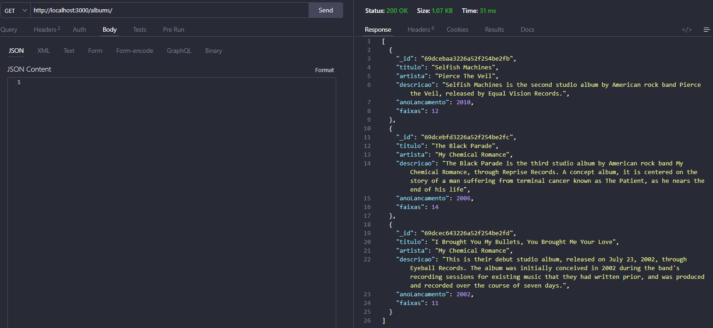

## 5.8 - Deletar album 

DELETE http://localhost:3000/albums/:id

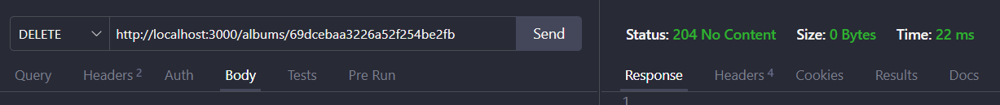

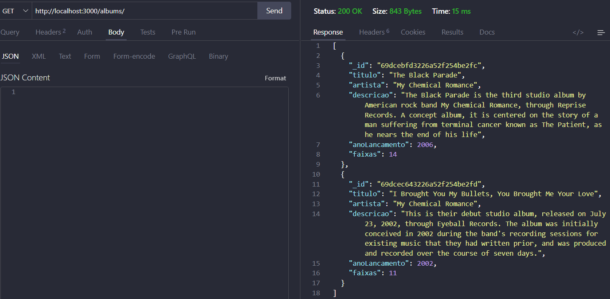
